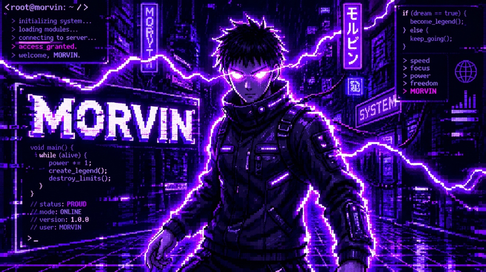
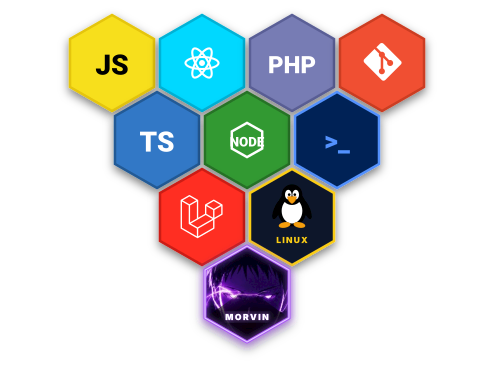

<div align="center">

  <!-- =============================== -->
  <!-- 🌌 NEON CYBERPUNK HEADER BANNER -->
  <!-- =============================== -->
  

  <!-- ⚡ ДИНАМИЧЕСКАЯ БЕГУЩАЯ СТРОКА С ЭФФЕКТОМ ПЕЧАТИ -->
  <a href="https://github.com/hellmorvin">
    
  </a>

  <br/>

  <!-- СТАТУСНЫЕ НЕОНОВЫЕ БЕЙДЖИ И СЧЕТЧИК -->
  <p align="center">
    
    
    
  </p>

</div>

<div align="center">
  
</div>

```typescript
/**
 * ⚡ MORVIN_CORE :: SYSTEM_EXEC [01101101.01101111]
 * DATA_STREAM   :: 01101101 01101111 01110010 01110110 01101001 01101110 (morvin)
 */
class CyberEntity {
  readonly identity = "MORVIN (hellmorvin)" as const;
  readonly role     = "Fullstack Developer & Systems Explorer";
  readonly status   = "🟢 ONLINE // Neural Link Active";

  public coreStack = {
    languages: ["TypeScript", "JavaScript", "PHP", "PowerShell"],
    frontend : ["React", "TailwindCSS"],
    backend  : ["Node.js", "Express"],
    systems  : ["Linux", "Windows 11 Pro", "Git"]
  };

  public execute(): string {
    return "Forging clean architecture in dark neon aesthetics. 🚀";
  }
}

export default new CyberEntity();
```

---

<div align="center">

### 🔮 Мой стек технологий // Tech Stack



</div>

---

<div align="center">

### 📊 Активность коммитов // Commit Streak

<!-- Стрик активности с неоновым фиолетовым кольцом пламени -->
<p align="center">
  
</p>

</div>

---

<div align="center">
  <!-- Неоновый футер -->
  
  <sub>⚡ Designed with dark passion by <b>MORVIN</b> &copy; 2026</sub>
</div>
